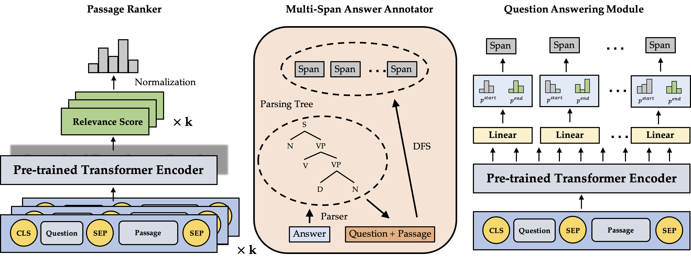

# Multi-span Style Extraction for Generative Reading Comprehension
Code for the paper:
[Multi-span Style Extraction for Generative Reading Comprehension](https://arxiv.org/abs/2009.07382)  
Junjie Yang, Zhuosheng Zhang, Hai Zhao


## Dependencies
The code was tested with `python 3.7` and `pytorch 1.2.0`. If you use conda, you can create an env and install them as follows:
```
conda create --name marco python==3.7
conda install pytorch==1.2.0 torchvision==0.4.0 cudatoolkit=10.0 -c pytorch
```

Install the required packages:
```bash
pip install -r requirements.txt
```

Install standford corenlp: https://stanfordnlp.github.io/CoreNLP/

## Datasets
You can download MS Marco v1.1 dataset here: 
https://microsoft.github.io/msmarco/. Put all the files into a data directory.

Now preprocess the datasets:
```bash
cd preprocessing
# Spilt 'qa' and 'nlg' subsets
python dataset_spilt.py --data_dir=${data_dir}

# Create dev reference files for evaluation
python create_dev_ref.py --data_dir=${data_dir} --task='qa'
python create_dev_ref.py --data_dir=${data_dir} --task='nlg'
```

## Ranking
Marco provides mutiple reading passages for each question, so before answering question, we need to select the most relevant one.

Train a ranker on 4 GPUs:
```bash
cd ../ranker
python main.py \
    --model_name_or_path='albert-base-v2' \
    --data_dir=${data_dir} \
    --output_dir=${expr_dir}/ranker
    --do_train \
    --learning_rate=1e-05 \
    --num_train_epochs=3.0 \
    --warmup_steps=2497 \
    --per_gpu_train_batch_size=32 \
    --eval_steps=8324 \
    --logging_steps=100 \
    --max_seq_length=256 \
    --seed=96 \
    --weight_decay=0.01
```
Eval the trained model on dev set:
```bash
export TRAINED_MODEL=${expr_dir}/ranker
python main.py \
    --data_dir=${data_dir}  \
    --model_name_or_path=$TRAINED_MODEL \
    --output_dir=$TRAINED_MODEL/res  \
    --max_seq_len=256 \
    --do_eval \
    --per_gpu_pred_batch_size=128  
```
You will find the evaluation results in a file named `dev_eval_results.txt` in the `output_dir`:
```
map = 0.7109500464755606
mrr = 0.715590335907891
```
Now select the most relevant passages with our ranker on dev set:
```bash
python select_best_passage.py \
    --data_dir=${data_dir} \
    --ranking_res_file=${expr_dir}/ranker/dev_best_passage_pred.json \
    --set_type=dev
```
This will generate a file named as `dev_from_self_ranker.jsonl`.


> The following scripts shows the experiments on NLG subset, for QA subset, you just need to change argument `task` or `task_name` to "qa".
## Syntactic multi-span answer annotator
Now we need to transform the original answers in the training set to annotated spans.

Start Stanford CoreNLP Parser server:
```bash
java -mx20g -cp "*" edu.stanford.nlp.pipeline.StanfordCoreNLPServer \
    -preload tokenize,ssplit,pos,parse \
    -port 8889 
```
Get annotated answer spans:
```bash
cd qa_multi_span
python annotator.py \
    --train_data_file=... \
    --model_name="albert-xlarge-v2" \
    --parser_url="http://localhost:8889" \
    --set_type="train" \
    --task="nlg" \
    --output_file="train_span_annotation.json"
```

## Question-answering module
Training:
```bash
python main.py \
    --model_name_or_path=albert-xxlarge-v2 \
    --do_train \
    --data_dir=${data_dir}  \
    --output_dir=${expr_dir} \
    --eval_file=dev_from_self_ranker.jsonl \
    --span_annotation_file="train_span_annotation.json" \
    --overwrite_output_dir  \
    --per_gpu_train_batch_size=8   \
    --per_gpu_pred_batch_size=8  \
    --num_train_epochs=5.0 \
    --learning_rate=3e-5 \
    --evaluate_during_training \
    --eval_steps=1846\
    --max_seq_len=256 \
    --max_num_spans=9 \
    --ed_threshold=8\
    --task_name=nlg \
    --seed=1996
```

Evaluate on dev set with passages selected by our trained ranker:
```bash
python main.py \
    --model_name_or_path=${expr_dir} \
    --output_dir=${expr_dir}/dev_with_ranker  \
    --do_eval \
    --data_dir=${data_dir}  \
    --eval_file=dev_from_self_ranker.jsonl \
    --per_gpu_pred_batch_size=32   \
    --max_seq_len=512 \
    --max_num_spans=9\
    --reference_file=dev_ref.json \
    --task_name=nlg
```
## License 
MIT